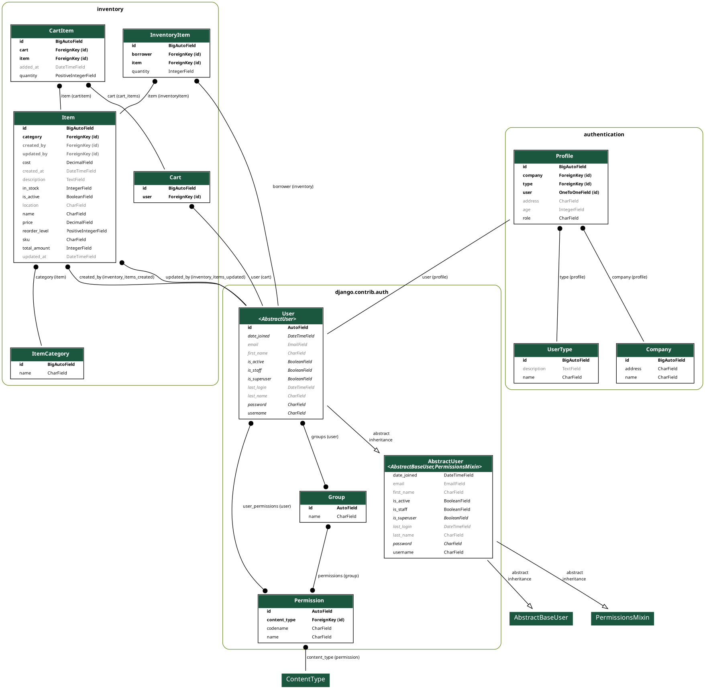

# Inventro Final Report

## Team Information

- **Terry Luan** — t.luan@mail.utoronto.ca — Student ID: 1005951427
- **Harsanjam Saini** — harsanjam.saini@mail.utoronto.ca — Student ID: 1007360516
- **Alexander Vicol** — alexander.vicol@mail.utoronto.ca — Student ID: 1008004231
- **Shubham Panchal** — s.panchal@mail.utoronto.ca — Student ID: 1012431067

## Motivation

In many small and medium-sized businesses, inventory management is still handled through outdated software or manual spreadsheets that lack real-time synchronization, scalability, and reliability. These systems make it difficult to monitor stock levels accurately across distributed warehouses or retail locations. As a result, manual data entry and disconnected systems frequently lead to stockouts, overstocking, and data inconsistencies, all of which negatively affect operational efficiency and customer satisfaction.

While modern inventory management tools such as Zoho Inventory, Sortly, or Ordoro provide advanced functionality, they can cost hundreds of dollars per month, making them impractical for small teams and startups. Moreover, these third-party SaaS solutions are hosted externally, meaning users often lack full ownership and control over their data. For small businesses that prioritize affordability, customization, and privacy, this remains a significant limitation.

To address these challenges, the team developed **Inventro**, a cloud-native, real-time inventory management system that is reliable, scalable, and self-hosted. Inventro leveraged containerized services to ensure consistent performance, persistent cloud storage to maintain state across restarts and redeployments, and Kubernetes orchestration to provide automated scaling and fault tolerance. The system also incorporated real-time communication and alerting mechanisms (where time permitted) to reduce downtime and support faster, data-driven decision-making for managers and staff.

This project was worth pursuing because it demonstrated core cloud computing concepts—including containerization, orchestration, CI/CD, monitoring, and persistence—in a realistic business context. Inventro not only gave the team hands-on experience with modern cloud technologies but also delivered tangible value by creating an affordable, customizable, and secure inventory management platform tailored to small and medium enterprises.

The target users were warehouse managers, retail operators, and staff in small to medium-sized businesses who required an accessible yet robust solution for tracking inventory across multiple locations. By giving users full control over their deployment, scalability, and data, Inventro aimed to bridge the gap between costly commercial platforms and limited manual systems, offering a practical, high-performance alternative aligned with real business needs and modern cloud-native design principles.

## Objectives

The primary goal of the project was to build and deploy a **stateful, cloud-native web application** that allowed users to create, update, and track inventory items in near real time. The system was designed to use **DigitalOcean Volumes**, **Django**, and **DigitalOcean Kubernetes (DOKS)** to ensure persistent storage, secure access control, and proper data monitoring. This architecture showcased the core principles of **containerization, orchestration, persistence, and observability** required by ECE1779.

Inventro was intended to provide a reliable, scalable, and self-hosted inventory management platform that gives users full control over their data while reducing operational costs. The project also fulfilled ECE1779’s technical learning objectives by integrating persistent storage, automated deployment pipelines, and real-time monitoring into a production-grade system.

### Core Functional & Technical Objectives

The project objectives were:

- **Stateful Web Application:**  
  Build a production-ready inventory management system that supports item CRUD, categorization, carts, and secure access control.

- **Persistent Storage:**  
  Store data in PostgreSQL backed by Persistent Volume Claims (PVCs), ensuring that inventory data survives restarts and rolling updates.

- **Cloud-Native Deployment:**  
  Containerize the application with Docker and deploy it on DigitalOcean Kubernetes (DOKS) using Deployments, Services, and PVCs, with a load-balanced entrypoint.

- **Observability & Monitoring:**  
  Integrate DigitalOcean metrics, Kubernetes logs, and (optionally) Grafana dashboards to monitor CPU, memory, disk usage, and pod health.

- **DevOps & Automation:**  
  Implement CI/CD with GitHub Actions to automate build, test, and deployment of Docker images, and configure automated PostgreSQL backups using a Kubernetes CronJob.

- **Stretch Real-Time Features (optional):**  
  Explore real-time stock updates via Django Channels/WebSockets and serverless email notifications for low-stock alerts. These were treated as stretch goals and implemented partially where time allowed (WebSockets) rather than as core requirements.

Overall, the final system met the core objectives: it was a stateful, containerized, Kubernetes-deployed application with persistent storage, monitoring, CI/CD, and automated backups, closely aligned with the original proposal.

## Technical Stack

- **Frameworks:**  
  Django + Django REST Framework, with HTMX-enhanced templates for lightweight interactivity.

- **Database:**  
  PostgreSQL with Persistent Volume Claims (PVCs) to preserve data across restarts and rolling updates.

- **Containerization:**  
  Docker images and multi-container orchestration via `docker compose` for local development.

- **Orchestration:**  
  Kubernetes (DOKS) with Deployments, Services, Secrets, ConfigMaps, and volume claims; CronJobs for scheduled backups.

- **Storage & Backups:**  
  DigitalOcean Volumes for the database and a DigitalOcean Spaces bucket for automated backup archives.

- **Monitoring:**  
  Provider metrics (DigitalOcean), Kubernetes logs, and optional Grafana dashboards to watch CPU, memory, and pod health.

- **CI/CD:**  
  GitHub Actions workflows that built and pushed images, then applied Kubernetes manifests for consistent releases.

## Features

The final application offered a set of features that directly supported the project objectives and demonstrated the required course technologies.

- **Authentication & Roles:**  
  We implemented secure login using Django’s authentication system. Admin, manager, and staff roles limited what users could see or modify, ensuring that sensitive operations—such as changing stock levels—were restricted to authorized users.

- **Inventory CRUD:**  
  The system supported creating, editing, soft-deleting, and listing items with metadata such as SKU, quantity, cost, location, and category. These operations were available both via the web UI and REST APIs, demonstrating a stateful backend integrated with PostgreSQL.

- **Categorization:**  
  A managed category model kept item organization consistent across the UI and APIs. This provided structured filtering and reporting, which was important for dashboards and low-stock analysis.

- **Carts & Requests:**  
  Users could assemble carts, add or remove items, and submit requests for stock movements through RESTful endpoints. This represented realistic warehouse workflows (e.g., picking orders, internal transfers) and showcased multi-entity state management in the database.

- **Dashboarding:**  
  Server-rendered dashboards summarized available items, recent activity, and quick links to common flows. Dashboards were built using Bootstrap and HTMX, with support for auto-refreshing stats and basic visualizations so operators could see the current state at a glance.

- **Persistence & Resilience:**  
  PostgreSQL data survived pod restarts through PVCs. Backup CronJobs exported snapshots to object storage, providing a recovery path in case of data corruption or accidental deletions.

- **Scalable Delivery:**  
  The same Docker images used for local development via `docker compose` were deployed to Kubernetes with configurable replicas, readiness/liveness probes, and resource limits. This ensured dev/prod parity and demonstrated scalable, cloud-native delivery.

- **Real-Time & Advanced Features (where implemented):**  
  CI/CD pipelines were fully implemented with GitHub Actions. Automated backups ran via a Kubernetes CronJob. WebSocket-based alerts were explored and integrated where feasible to provide near real-time feedback on key events such as stock changes.

Taken together, these features fulfilled the course project requirements: a **stateful**, **containerized** application running on **Kubernetes** with **persistent storage**, **monitoring**, and **at least two advanced features** (CI/CD and automated backups, with optional WebSocket alerts).

## Fulfillment of Course Requirements

<table>
  <tr>
    <td><b>Requirement</b></td>
    <td><b>Implementation in Project</b></td>
  </tr>
  <tr>
    <td>Containerization &amp; Local Dev</td>
    <td>Docker and Docker Compose were used to set up the Django application and PostgreSQL database for local development.</td>
  </tr>
  <tr>
    <td>State Management</td>
    <td>Application state was managed using PostgreSQL with persistent volumes for durable storage.</td>
  </tr>
  <tr>
    <td>Deployment Provider</td>
    <td>The application was deployed on DigitalOcean Kubernetes (DOKS).</td>
  </tr>
  <tr>
    <td>Orchestration</td>
    <td>Kubernetes Deployments, Services, and PersistentVolumeClaims (PVCs) were configured to orchestrate the application components.</td>
  </tr>
  <tr>
    <td>Monitoring</td>
    <td>Monitoring was performed using the DigitalOcean Metrics Dashboard together with Kubernetes logs, with optional Grafana dashboards.</td>
  </tr>
  <tr>
    <td>Advanced Features (≥2)</td>
    <td>CI/CD was implemented with GitHub Actions, automated backups were configured via a Kubernetes CronJob, and WebSocket-based alerts were explored as an optional enhancement.</td>
  </tr>
</table>

The project scope was realistic for a four-person team within the 5-week course timeline. Each team member focused on one major subsystem (frontend, backend, architecture, and DevOps), which enabled efficient parallel development. The system’s modular design allowed incremental feature integration while maintaining a deployable state throughout the project.

Optional features (such as serverless components and WebSockets) were only addressed after the core milestones had been completed, ensuring that the primary deliverables were prioritized. This approach allowed the team to deliver a fully functional, containerized, and monitored stateful application by the due date while demonstrating mastery of all required course technologies.

The final system satisfied all course technical requirements and maintained a realistic and achievable scope. The objectives were specific and mapped directly to the ECE1779 course technologies: a containerized application with local development using Docker and Docker Compose, deployment on Kubernetes, PostgreSQL with persistent storage, provider-based monitoring, and at least two advanced features (continuous integration and deployment, automated backups, and real-time alerts where implemented). The scope was deliberately sized for a four-person team and the project timeline.

## Architecture Overview

1. **Frontend:**  
   Bootstrap-based templates with HTMX enhancements kept page loads fast while avoiding a heavy SPA. The UI consumed REST APIs where appropriate and used partial HTML updates for responsive interactions.

2. **Backend:**  
   Django REST Framework exposed APIs for inventory, cart management, and authentication, while Django admin enabled operational oversight. Business logic for permissions, validation, and inventory rules was centralized in the backend.

3. **Data Layer:**  
   PostgreSQL stored transactional data, including users, items, categories, and carts. Django migrations tracked schema changes over time. Persistent volumes bound the database to durable disk in the Kubernetes cluster.

4. **Platform:**  
   Docker images encapsulated the application and its dependencies. Kubernetes Deployments managed rollouts and scaling, Services exposed HTTP entrypoints, and CronJobs handled scheduled backups to object storage.

5. **Observability:**  
   Provider metrics and Kubernetes logs were used to monitor resource usage and application health. This observability allowed the team to diagnose performance issues, tune resource requests/limits, and verify that rollouts were proceeding smoothly.

  

## User Guide

This section explains how an end user (admin, manager, or staff) interacts with Inventro.  
All screenshots are taken from the deployed application.

### 1. Signing In

1. Open the application in your browser (local or production URL).
2. On the **login page**, enter your email and password.
3. Click **Log in** to access the system.  
   - The demo deployment ships with seeded accounts such as:
     - `admin@inventro.com / admin123`
     - `manager@inventro.com / manager123`

After a successful login, you are redirected to the main dashboard.

  

---

### 2. Navigation and Roles

The left sidebar is the main navigation:

- **Dashboard** – high-level stats and recent activity.
- **Inventory** – full inventory table for all items.
- **My Inventory** – items currently assigned to the logged-in user.
- **Add Item** – create a new inventory item (staff/admin).
- **Analytics** – charts and trends over time (admin).
- **Add User** – create new user accounts (admin).

What you see depends on your role:

- **Admins** can manage users, items, and analytics.
- **Managers/Staff** focus on inventory, carts, and their own items.

---

### 3. Viewing and Searching Inventory

Click **Inventory** in the sidebar to open the main inventory table.

From here you can:

1. **Search** using the search box at the top (“Search by name, SKU, or vendor”).
2. **Filter** using the status and category dropdowns.
3. **Change page size** (e.g., show 10 / 25 items per page).
4. **Page through results** with the paginator at the bottom.
5. Use the **Actions** column to:
   - View/edit an item,
   - Add it to your cart,
   - Soft-delete (retire) it.

  

---

### 4. Working With Your Own Inventory

The **My Inventory** page shows only items associated with the current user (for example, items a staff member is responsible for).

On this page, you can:

- Search and filter just like on the main inventory page.
- Quickly see quantities and SKUs for your assigned items.
- Add items to your cart using the cart icon in the **Actions** column.

  

---

### 5. Adding a New Inventory Item

Users with the appropriate permissions (staff/admin) can add items via **Add Item**:

1. Click **Add Item** in the sidebar.
2. Fill in the form fields:
   - **Item Name**
   - **SKU**
   - **Category**
   - **Location** (e.g., warehouse or shelf)
   - **Total Quantity**
   - **Price**
   - Optional **Description**
3. Click **Add Item** to save.

The new item appears immediately in the inventory table and is included in dashboard stats.

  

---

### 6. Building and Viewing Carts

From either **Inventory** or **My Inventory**, you can add items to a cart.

#### 6.1 Add an Item to Cart

1. In the **Actions** column, click the **cart icon** for the item you want.
2. A modal appears asking how many units to add.
3. Enter the **Quantity** (up to the available stock shown).
4. Click **Add to Cart**.

  

#### 6.2 View Your Cart

1. Click **See my Cart** in the top-right corner.
2. The **Your Cart** page lists all items you have added and their quantities.
3. From here you can:
   - Continue shopping (return to Inventory),
   - Proceed to checkout or use the cart contents as the basis for a pick/transfer request, depending on your workflow.

  

---

### 7. Managing Users (Admin Only)

Admins can create new accounts via the **Add User** page:

1. Click **Add User** in the sidebar.
2. Fill in:
   - **Username**
   - **Email address**
   - **Role** (e.g., Admin, Manager, Staff)
   - **Password** and **Password confirmation**
3. Click **Create** to add the user.

The new user can then log in and access features according to their role.

  

---

### 8. Monitoring Status and Analytics

The **Dashboard** and **Analytics** sections provide a summarized view of the system:

- The **Dashboard** shows:
  - Total items,
  - Low-stock and out-of-stock counts,
  - Inventory value and recent items,
  - A recent activity feed.
- The **Analytics** page shows charts for:
  - Inventory trends over time,
  - Items by category,
  - Status trends,
  - Value over time.

Both pages are powered by `/api/stats/` and `/api/metrics/` and automatically refresh every few seconds, so inventory changes are reflected without reloading the page.

---

### 9. Logging Out

To end your session securely, use the logout option (via the user menu or Django admin, depending on deployment). Logging out clears your session and returns you to the login screen.

## Development Guide
Local development is quite simple thanks to the magic of Docker and Docker Compose!  
Inventro uses the compose.dev.yaml configuration, which includes:
* A PostgreSQL container (based on the `postgres:15` image)
* An application container built from a custom Dockerfile (based on the `python:3.11-slim` image)  

The application container mounts the project directory, allowing the app to automatically reload when local files change. On startup, the app also seeds the database with default data.

### Prerequisites
- Git
- Docker
- Docker Compose

### Local Setup
1. **Clone the repository:**   
    `git clone https://github.com/terryluan12/Inventro`

2. **Ensure the environment variables are set:**  
    For more information, check out the [environment variable section](#environment-variables)

3. **Start services locally:**  
   `docker compose -f compose.dev.yml up --build`  
4. **Access the app:**  
    Web UI: `http://localhost:800`  
    REST API: `http://localhost:8000/api/`

### Testing

- **Unit tests:**  
  Run `pytest` inside the web container or virtual environment.

- **API checks:**  
  Use `curl` or Postman against the `/api/` routes for inventory and carts.

- **Static analysis (optional):**  
  Run tools such as `flake8` and `isort` locally to maintain formatting and style consistency.

## Deployment Guide
For deployment, you can easily deploy using Docker, and Kubernetes!

### Prerequisites
- Git
- Bash
- Docker
- Kubernetes (kubectl)

### Local Setup
1. **Clone the repository:**   
    `git clone https://github.com/terryluan12/Inventro`

2. **Ensure the environment variables are set:**  
    For more information, check out the [environment variable section](#environment-variables)

3. **Build and push the Docker Image**  
    From the inventro root:  
    `docker build -t inventro-web .`  
    `docker tag inventro-web <your-registry>/inventro-web:latest`  
    `docker push <your-registry>/inventro-web:latest`  
    
    Currently, the only supported registry is DigitalOcean.  
    To change the registry change the base url in `k8s/deployments/web-deployment.yaml`

4. **Deploy the app:**  
    `cd k8s`  
    `bash deploy.sh`

## Environment Variables
Inventro requires several environment variables to be set before it can run, whether locally, through docker, docker compose, or kubernetes.

### Local/Docker/Docker-Compose Deployment
  1. Copy the file `.env.example`
  2. Rename the copy to `.env`
  3. Update the values in `.env` as needed

### Kubernetes Deployment
When deploying with Kubernetes, environment variables should be configrued in either `k8s/config` or `k8s/secrets`

Unlike when deploying locally or through Docker/Docker-Compose, most values will need to be provided manually, as they have been left out intentionally for security reasons

Below is a table of environment variables that need to be set:

| **Variable**              | **Default**         | **Description**                                                                   |
|---------------------------|---------------------|-----------------------------------------------------------------------------------|
| DEBUG*                    | 0                   | Django mode. Assign 1 for debug                                                   |
| DJANGO_SECRET_KEY         | django_insecure_key | Django secret key                                                                 |
| DJANGO_SUPERUSER_USERNAME | admin               | Default inventro admin username                                                   |
| DJANGO_SUPERUSER_EMAIL    | admin@inventro.com  | Default inventro admin email                                                      |
| DJANGO_SUPERUSER_PASSWORD | admin123            | Default inventro admin email password                                             |
| POSTGRES_DB               | inventro            | Postgres database name                                                            |
| POSTGRES_HOST             | localhost           | Postgres database host                                                            |
| POSTGRES_USER             | postgres            | Postgres user username.                                                           |
| POSTGRES_PASSWORD         | password            | Postgres user password                                                            |
| POSTGRES_PORT             | 5432                | Postgres server open port                                                         |
| ALLOWED_HOST              | localhost           | Allowed hosts                                                                     |
| CSRF_TRUSTED_ORIGIN       | localhost:8000      | Trusted CSRF Origins                                                              |
| DO_SPACES_KEY**           |                     | The S3-compatible API Key                                                         |
| DO_SPACES_SECRET**        |                     | The S3-compatible Secret Key                                                      |
| DO_SPACES_REGION**        |                     | Region where the S3-compatible bucket is hosted                                   |
| DO_SPACES_BUCKET**        |                     | The name of the S3-compatible Bucket                                              |

\* DEBUG is automatically set when running compose.dev.yaml, compose.prod.yaml, and when running the k8s  
\*\* Only available through docker-compose

## Individual Contributions

The project tracked four members. Summaries below describe the main areas each member owned or significantly contributed to.

### Terry Luan

Terry led the core backend integration and deployment foundations for Inventro. His main contributions included:

- **Project Bootstrap & Core Apps**
  - Initialized the Django project and key apps (`inventory`, `cart`, `orders`, `users`).
  - Integrated **Django REST Framework** and implemented the initial API endpoints for items and carts.
  - Created and maintained `requirements.txt` to standardize dependencies for local development, Docker builds, and CI.

- **Inventory, Auth & Cart Integration**
  - Migrated and wired up the **inventory** and **login** pages to the Django backend.
  - Connected the inventory table to the backend so items, pagination, and metadata are served from PostgreSQL.
  - Introduced a dedicated authentication/users app and set `LOGIN_URL` in `settings.py`, cleaning up how user data and login flows are handled.
  - Fixed multiple UI/UX issues (login page, sidebar highlighting, back button routing, naming consistency from “products” to “inventory”).
  - Reviewed and **merged the `cart_page` branch**, ensuring the cart UI was correctly hooked up to the existing models, views, and templates.

- **Data Seeding & Populate Scripts**
  - Authored and iteratively refined database populate scripts (`populate.py`, `populate_database.py`) to seed items and metadata for testing.
  - Added support for **cost** and **location** fields in the populate logic to match the evolving Item model.
  - Hooked database population into `entrypoint.sh` and adjusted Docker Compose startup so developers could get a usable environment with realistic test data in one command.

- **Docker, Nginx & Local Dev Experience**
  - Fixed and stabilized the **Dockerfile** and web container configuration.
  - Introduced an Nginx container and related configuration to support a more production-like setup.
  - Reorganized the Django code into an inner `inventro` directory to simplify imports and deployment.
  - Added separate **dev and prod Docker Compose files** and tuned volumes so code changes reflect correctly in the dev environment.

- **Kubernetes Manifests, CronJob & Repo Integration**
  - Added and refactored Kubernetes manifests, including Nginx objects and namespace changes to `inventro`, and split components into clear YAML files (deployments, services, etc.).
  - **Implemented and later fixed the PostgreSQL backup CronJob Kubernetes file**, ensuring scheduled dumps to object storage work as intended.
  - Authored and reviewed multiple merge commits (e.g., integrating Shubham’s CI/CD + Kubernetes work, Alex’s RBAC/metadata branch, and the cart feature branch), resolving conflicts and keeping the `main` branch deployable.

Overall, Terry owned the backbone of the project: he turned a bare Django app into a working, containerized service with connected front-end pages, realistic seed data, a functioning backup CronJob, and a clean path to Kubernetes deployment.

### Harsanjam Saini
Harsanjam’s work focused on the core stateful features (inventory and carts) and the advanced analytics/real-time behaviour. His contributions spanned from the initial UI prototype to the data-driven, real-time dashboard used in the final system, as well as debugging and testing of the CI/CD Pipeline through GitHub actions workflow (Advanced Feature #1).

- **Core UI Shell & Auth Flow**
  - Implemented the initial **frontend shell** for the app: `index.html`, `inventory.html`, and `login.html` under `inventro/templates/frontend/`, plus supporting CSS/JS assets.
  - Designed the Bootstrap-based **dashboard, sidebar, and topbar layout**, as well as a styled login card, giving the team a cohesive user experience to build on.
  - Ensured all assets were wired correctly through Django’s `` system so the same UI works in local Docker and in Kubernetes.

- **Inventory CRUD UX & Fixes (Stateful Web Application)**
  - Built out the **inventory table** with search, chips, row actions, and early HTMX hooks for search and pagination.
  - Later upgraded the **Add Item** and **Edit Item** flows by:
    - Fixing POST handling in `item_form` views so create/update logic actually persists data.
    - Correcting mismatched field names (`sku` / `total_amount` / `in_stock`) between forms and models.
    - Ensuring **soft-delete** semantics work end-to-end so history is preserved while keeping the main list clean.
  - Fixed search behaviour so queries by name/SKU work correctly and the search term is preserved on reload, making inventory management actually usable for staff.

- **Carts & Requests – Security, API, and State Management**
  - Performed a deep audit of the **cart subsystem** and documented issues (user model mismatch, missing permissions, incomplete serializers, missing endpoints).
  - Implemented the fixes that turn carts into a secure, production-ready feature:
    - Switched the `Cart` model to use `settings.AUTH_USER_MODEL` so it aligns with Django auth and works with `request.user`.
    - Locked down `CartViewSet` with `IsAuthenticated` and user-scoped querysets so each user only sees their own cart.
    - Added nested serializers (`CartItemSerializer`, enhanced `CartSerializer`) to expose quantities, timestamps, and full item details.
    - Added custom actions for **add_item**, **remove_item**, **update_quantity**, and **clear**, making carts a fully functional REST API that underpins the “Carts & Requests” objective.

- **Dashboard Stats & Analytics APIs (Observability & Advanced Features)**
  - Implemented the backend **stats and metrics endpoints** that power the dashboard and analytics pages:
    - `/api/stats/` returns total items, low/out-of-stock counts, inventory value, recent items, and category counts.
    - `/api/metrics/` provides time-series and categorical data for charts (inventory trends, items by category, status trends, value over time).
  - Ensured all calculations use the correct fields (`in_stock`, `total_amount`, `cost`) and are SQLite-safe so development and production behave consistently.
  - Added a **recent activity feed** and corresponding API so the dashboard reflects real changes in inventory over time.

- **Frontend API Client & Real-Time Dashboard (Stretch Real-Time Feature)**
  - Implemented the shared **frontend API client** (`api.js`) and UI helpers (`ui.js`, `app.js`) to make the dashboard, inventory, add-item, and analytics pages fully **data-driven** instead of static:
    - API client supports `login()`, full inventory CRUD, and `getStats()/getMetrics()` calls.
    - UI helpers handle toast notifications, form serialization, dynamic table rendering, and chart setup.
  - Wired the dashboard and analytics to the stats/metrics API and added **auto-refresh polling**:
    - `setupDashboard()` and `setupAnalytics()` poll `/api/stats/` and `/api/metrics/` every 10 seconds.
    - Charts and stat boxes update automatically, providing near real-time feedback on stock levels and trends without page reloads.
  - Made the API base URL dynamic (`window.location.origin`) so the same JS works on localhost and the DigitalOcean/Kubernetes deployment.

- **Architecture & Repo Quality**
  - Authored a detailed **architecture analysis** (persistent storage on DO Volumes, recommended PostgreSQL indexes, system diagram including CI/CD and backup layers), tying the implementation directly back to the course’s cloud-native and observability objectives.
  - Cleaned up redundant prototype and documentation files as the project matured, keeping the repository focused on the final implementation.

Overall, Harsanjam was responsible for turning the core inventory and cart models into a **usable, secure, and observable system**, from UI and workflows, through REST APIs and security, to real-time dashboard analytics that demonstrate the project’s advanced features.

### Alexander Vicol

Alexander focused on role-based access control (RBAC), inventory metadata and audit features, and the documentation linking Inventro’s implementation to the ECE1779 cloud-native requirements. He also spent significant time debugging and stabilizing the local Django stack—including login, templates, and authentication—so the rest of the team could test the application reliably.

Role-Based Access Control & User Flows

Alexander designed and implemented the RBAC layer used across the application. He introduced role fields and helper utilities to categorize users as Admin, Manager, or Staff, then integrated these roles into Django views, templates, and navigation. Protected routes such as the dashboard, inventory management, and user administration now validate the logged-in user’s role before granting access. This ensures only authorized users can perform sensitive operations like adding or editing inventory or managing accounts. He also configured login redirect logic so users arrive at the appropriate dashboard after authentication and confirmed that redirects correctly respect LOGIN_URL and LOGOUT_REDIRECT_URL.

Metadata & Audit Trail for Inventory

To improve observability of inventory changes, Alexander extended the data model and views with additional metadata and audit fields. He added attributes such as created_by, updated_by, and last_updated timestamps to relevant models and ensured they are populated automatically through views and forms. This information is surfaced in the admin, API serializers, and, where appropriate, the dashboard, allowing managers to see who made changes and when. These updates directly support the stateful application and observability objectives by making item histories and user actions more transparent.

Monitoring, Stateful Design & Documentation

Alexander authored substantial portions of the documentation connecting the running system to ECE1779’s expectations around persistence, monitoring, and advanced features. He documented how PostgreSQL data is persisted using DigitalOcean Volumes and PVCs, how the backup CronJob integrates with object storage, and how state is preserved across pod restarts and rolling deployments. He also outlined how provider metrics (DigitalOcean graphs) and Kubernetes logs are used to monitor CPU, memory, and pod health, and how these tools align with realistic production workflows. This content appears in the Motivation, Objectives, Technical Stack, and Stateful Design/Monitoring sections of the final report.

Local Dev, Docker/Kubernetes Touchpoints & Testing

Alexander helped stabilize local development in support of his RBAC and metadata work. He updated settings, URLs, and templates to integrate cleanly with Django authentication, resolved template and static asset issues (including login.html and static path fixes), and verified that seeded demo accounts (e.g., admin@inventro.com, manager@inventro.com) behave correctly under the new role logic. He also tested the multi-container setup (Django + PostgreSQL via Docker Compose) and validated Kubernetes manifests on his branch to ensure environment variables, migrations, and initial superuser creation function end-to-end.

Polish, Debugging & Presentation

Beyond implementation, Alexander contributed to polishing the project for a clear and reliable demo. He refined the login experience and branding (including the Inventro logo), prepared slide content and speaking notes emphasizing automated backups and CI/CD as advanced features, and reviewed report sections to ensure the narrative accurately reflects what was deployed. In the final weeks, he focused on last-mile debugging—addressing authentication errors, template resolution issues, and role permission edge cases—so the full demo flow (login, dashboard, inventory, and carts) runs smoothly for TAs and instructors.

### Shubham Panchal 

Shubham led the **cloud deployment and orchestration foundations** for Inventro and implemented core **Django inventory and authentication flows**. He focused on turning the application into a reliably deployable, locally testable cloud-native service while also shaping the day-to-day user experience through inventory and auth features. 

- **Cloud Architecture, Kubernetes & Local Orchestration**
  - Shubham designed the overall cloud architecture for Inventro as a containerized **Django + PostgreSQL** application running on **Kubernetes**. He wrote the initial Kubernetes manifests (Deployments, Services, Ingress, ConfigMaps/Secrets) that define how the web app and database run in the cluster, and ensured that the same configuration works cleanly on **local Kubernetes with Minikube**. This included validating Ingress rules, environment variables, and application startup in a real cluster. He also kept **Docker Compose** and Kubernetes setups aligned so developers can switch between docker-compose and Minikube without code changes, verifying that both paths run the application end-to-end. In addition, Shubham authored an initial **GitHub Actions workflow** to run Django checks and build/push Docker images, providing a concrete starting point for the team’s CI/CD pipeline. 

- **Inventory CRUD, Add Form & UI Enhancements** 
  - On the application side, Shubham implemented the core **inventory management flows**. He added both “add inventory” and “delete inventory” functionality by wiring URLs, views, and templates so items can be created and removed cleanly in PostgreSQL. He built the **Add Inventory** form on the frontend with clearly named fields that map directly to the Django Item model and view parameters, keeping backend data handling straightforward and maintainable. To improve usability at scale, he added and tuned **pagination and filtering** for the inventory table so large item lists remain performant and easy to navigate. He also made **dropdowns and filter options dynamic**, ensuring they are populated from real backend data and remain consistent with the evolving Item model (including new fields such as cost or location). Along the way, he fixed multiple **UI/UX issues** on the inventory page, improving layout, alignment, and consistency across the dashboard. 

- **Authentication, Login/Logout Flows & Navigation**
  - Shubham refined the **authentication and navigation flows** using Django’s built-in auth framework. He configured the login logic so that, after successful authentication, users are redirected directly to the **dashboard** rather than a generic landing page. He also ensured that **logout** cleanly terminates the session and redirects back to the **login page**, providing a predictable and secure user experience. To prevent accidental access to protected views, he verified that routes such as the dashboard and inventory pages correctly respect authentication and cannot be accessed via browser back navigation after logout. These changes made the application’s entry points and navigation feel much closer to a production system. 

- **Configuration, Secrets, Local Testing & Team Integration** 
  - On the configuration side, Shubham centralized sensitive settings—such as database credentials and secret keys—into **environment variables and Kubernetes secrets**, aligning Inventro with good DevSecOps practices. He tuned Django settings (ALLOWED_HOSTS, debug flags, static file handling) so the same codebase runs correctly with **Docker Compose**, **Minikube**, and remote Kubernetes deployments. He spent time **testing and validating local Docker workflows**, ensuring that other teammates could reliably bring up the stack, run migrations, and exercise features like login and inventory without environment surprises. Shubham also collaborated on and reviewed changes that touched deployment, CI, and configuration, helping integrate work on **RBAC/metadata**, **cart features**, and **backup jobs** without breaking the cloud setup or local development experience. 

- **Polish, Debugging & Presentation Support** 
  - Beyond pure implementation, Shubham contributed to **stabilizing and presenting** the system. He helped debug environment and deployment issues that affected demos, verified that key flows (login, dashboard, inventory operations) worked reliably in both Docker Compose and Minikube, and supported the team in preparing **presentations and walkthroughs** that highlighted the project’s cloud-native aspects. By combining infrastructure work with hands-on testing and demo preparation, he helped ensure that Inventro not only deployed successfully but also **looked and behaved like a polished, production-ready application** during evaluations. 

Overall, Shubham owned the **cloud and delivery backbone** of Inventro and the **core inventory/auth flows**: he ensured the project runs smoothly via **Docker Compose and Minikube**, provided an initial CI workflow for future automation, and delivered a clean, testable inventory experience backed by Django and PostgreSQL.

## Lessons Learned and Concluding Remarks

- Containerizing early simplified local onboarding and kept dev/prod parity high, minimizing surprise regressions.
- Kubernetes provided resilience and rollback safety but required disciplined secret management and careful resource tuning to remain cost-effective.
- Automated backups and CI/CD pipelines acted as critical guardrails; investing in them reduced risk more than any single application feature.
- Lightweight HTMX interactions paired well with Django, enabling the team to ship usable screens without the overhead of a full SPA.
- Overall, the project showed how a small team can retain ownership of data and infrastructure while still achieving reliability, observability, and a smooth user experience in a cloud-native environment.
